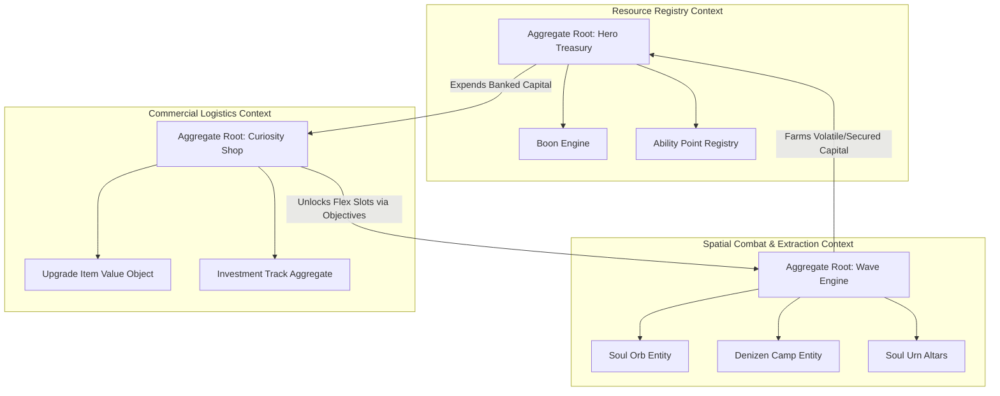
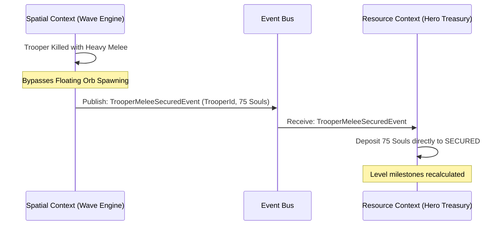
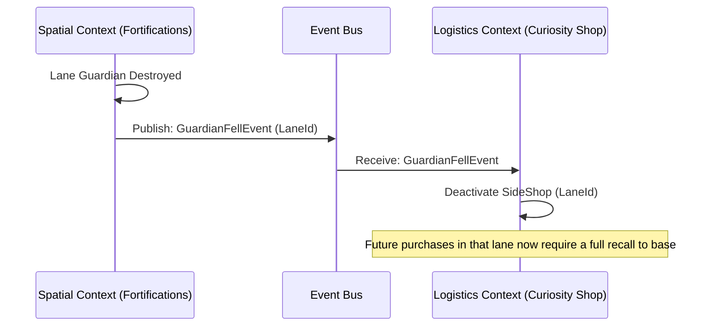

# Domain-Driven Design: Deadlock MOBA Economic Architecture

This document establishes the **Domain-Driven Design (DDD)** model for the unified in-game economy of *Deadlock*, based on the resource dynamics, spatial constraints, and commercial infrastructure outlined in [Deadlock MOBA In-Game Economy Analysis.md](file:///home/user/Desktop/gavmor/elden-chart/docs/Deadlock%20MOBA%20In-Game%20Economy%20Analysis.md).

---

## 1. Ubiquitous Language

To ensure conceptual alignment between data models, game state trackers, and visualization components, the following terms constitute the **Ubiquitous Language** of this domain:

```mermaid
glossary
    "Secured Soul" : permanent wealth immune to loss on death.
    "Unsecured Soul" : volatile wealth farmed from neutral zones, lost on death if threshold >= 150.
    "Laundering Rate" : the chronological passive conversion rate of Unsecured Souls to Secured Souls.
    "Soul Orb" : physical, ascending manifestation of trooper wealth that can be secured or denied.
    "Melee Bypass" : killing a Trooper with melee, granting instant Secured Souls and bypassing the orb phase.
    "Boon Milestone" : lifetime cumulative soul threshold that dictates hero levels, stat bonuses, and AP.
    "Flex Slot Gate" : macro-objective milestones (Guardians, Walkers) required to unlock inventory slots.
    "Logistical Starvation" : deactivation of Side Shops upon corresponding Guardian destruction, extending logistics.
    "The 4,800 Spike" : non-linear surge in baseline combat stats occurring upon spending 4,800 souls in a category.
    "AP Deficit" : the structural 2 AP shortage between Boon-based ability caps and the 32 AP ultimate maximum.
```

---

## 2. Bounded Context Map

The Deadlock economic engine is decomposed into three distinct **Bounded Contexts**, each managing a specific segment of the resource lifecycle.



### Context Details

1. **Resource Registry Context (Core Domain)**
   * *Core Responsibility*: Tracks liquid balances, lifetime net worth, volatile unsecured assets, passive laundering state, and boon-based level-up triggers.
   * *Strategic Role*: This is the absolute source of truth for a character's power rating and ability thresholds.

2. **Spatial Combat & Extraction Context (Supporting Subdomain)**
   * *Core Responsibility*: Manages physical resource nodes on the map. This includes Trooper wave generation, floating Soul Orbs, Denizen camp invulnerability gates, Sinner's Sacrifice vending timers, and the rubber-banding Soul Urn carrier state.
   * *Strategic Role*: Governs how wealth enters the economic pool and maps the vulnerability windows players expose themselves to during farming.

3. **Commercial Logistics Context (Supporting Subdomain)**
   * *Core Responsibility*: Governs the marketplace. Manages base, side, and secret shop availability, structural Flex Slot locks, component trade-in discounts, liquidation penalties, and the non-linear category investment tracks (e.g. the 4,800 spike).
   * *Strategic Role*: Handles the conversion of liquid capital into functional itemization and passive combat stat multiplier boosts.

---

## 3. Aggregate Roots, Entities, and Value Objects

Below are the concrete TypeScript domain models representing the aggregates, entities, and value objects within their respective Bounded Contexts.

### A. Resource Registry Context (Core)

```typescript
export type SoulState = 'SECURED' | 'UNSECURED';

export interface SoulTransaction {
  id: string;
  amount: number;
  state: SoulState;
  source: 'TROOPER_DEATH' | 'DENIZEN_CAMP' | 'HERO_KILL' | 'URN_DELIVERY' | 'CRATE_SMASH';
  timestamp: number;
}

/**
 * Value Object tracking the current level-up boons.
 */
export interface BoonState {
  currentBoons: number;
  highestAchievedSouls: number; // Max achieved net worth (tracks level-ups even if bankrupt)
  abilityPointsGranted: number;
  nextBoonDelta: number; // Souls required to hit the next level
}

/**
 * AGGREGATE ROOT: HeroTreasury
 * Encapsulates the core soul balances, volatile states, and leveling Boons.
 */
export class HeroTreasury {
  constructor(
    public readonly heroId: string,
    private _securedBalance: number,
    private _unsecuredBalance: number,
    private _highestAchievedSouls: number,
    private _abilityPoints: number,
    private _deliveredUrnApBonus: number // Tracks if the Urn AP bonus was applied
  ) {}

  public get securedBalance(): number { return this._securedBalance; }
  public get unsecuredBalance(): number { return this._unsecuredBalance; }
  public get highestAchievedSouls(): number { return this._highestAchievedSouls; }
  public get totalAbilityPoints(): number { return this._abilityPoints; }

  /**
   * Secured capital is safe. Unsecured capital is volatile.
   */
  public get liquidNetWorth(): number {
    return this._securedBalance + this._unsecuredBalance;
  }

  /**
   * Passive Laundering: Converts a fraction of Unsecured Souls to Secured over time.
   */
  public launderSouls(ratePerSecond: number, elapsedSeconds: number): void {
    const amountToLaunder = Math.min(this._unsecuredBalance, ratePerSecond * elapsedSeconds);
    this._unsecuredBalance -= amountToLaunder;
    this._securedBalance += amountToLaunder;
  }

  /**
   * Ingests a transaction, updating appropriate balances and boon thresholds.
   */
  public depositSouls(transaction: SoulTransaction): void {
    if (transaction.state === 'SECURED') {
      this._securedBalance += transaction.amount;
    } else {
      this._unsecuredBalance += transaction.amount;
    }

    const currentNet = this.liquidNetWorth;
    if (currentNet > this._highestAchievedSouls) {
      const delta = currentNet - this._highestAchievedSouls;
      this._highestAchievedSouls = currentNet;
      this.recalculateBoons(delta);
    }
  }

  /**
   * Catastrophic jungle wipeout: Drop all unsecured capital if threshold >= 150.
   */
  public handleElimination(): number {
    const droppedSouls = this._unsecuredBalance >= 150 ? this._unsecuredBalance : 0;
    this._unsecuredBalance = 0; // Entire unsecured pool is purged regardless
    return droppedSouls;
  }

  private recalculateBoons(netWorthIncrease: number): void {
    // Automated Boon recalculation logic...
  }
}
```

### B. Spatial Combat & Extraction Context (Supporting)

```typescript
export interface Position {
  x: number;
  y: number;
  z: number;
}

export type CampDifficulty = 'SMALL' | 'MEDIUM' | 'LARGE';

/**
 * ENTITY: DenizenCamp
 * Manages spatial commitment and anti-poaching invulnerability gates.
 */
export class DenizenCamp {
  constructor(
    public readonly campId: string,
    public readonly difficulty: CampDifficulty,
    public readonly position: Position,
    private _isEnclosedInCave: boolean,
    private _isInvulnerable: boolean,
    private _lastClearedTimestamp: number
  ) {}

  public get isInvulnerable(): boolean { return this._isInvulnerable; }

  /**
   * Anti-Poaching Guard: Outdoor camps remain invulnerable until close-quarters engagement.
   */
  public onPlayerProximity(playerPosition: Position, proximityThreshold: number): void {
    if (this._isInvulnerable && !this._isEnclosedInCave) {
      const distance = this.calculateDistance(this.position, playerPosition);
      if (distance <= proximityThreshold) {
        this._isInvulnerable = false; // Activates and becomes farmable
      }
    }
  }

  /**
   * Calculates dynamic scaling of the camp's soul bounty based on match time.
   */
  public getBounty(matchTimeSeconds: number): number {
    const minutes = matchTimeSeconds / 60;
    switch (this.difficulty) {
      case 'SMALL':
        return 44 + (0.528 * minutes);
      case 'MEDIUM':
        return 88 + (1.06 * minutes);
      case 'LARGE':
        return 220 + (2.64 * minutes);
    }
  }

  private calculateDistance(posA: Position, posB: Position): number {
    return Math.sqrt(
      Math.pow(posA.x - posB.x, 2) +
      Math.pow(posA.y - posB.y, 2) +
      Math.pow(posA.z - posB.z, 2)
    );
  }
}
```

### C. Commercial Logistics Context (Supporting)

```typescript
export type Discipline = 'WEAPON' | 'VITALITY' | 'SPIRIT';
export type ItemTier = 1 | 2 | 3 | 4;

/**
 * VALUE OBJECT: CuriosityUpgrade
 * Represents an items tier, price, and component links.
 */
export class CuriosityUpgrade {
  constructor(
    public readonly upgradeId: string,
    public readonly name: string,
    public readonly discipline: Discipline,
    public readonly tier: ItemTier,
    public readonly baseCost: number,
    public readonly parentUpgradeId: string | null // Supports component discount trees
  ) {}

  /**
   * Component Discounts: Deducts full cost of the Tier 1 item if upgrading linearly.
   */
  public getCostForHero(inventoryUpgrades: string[]): number {
    if (this.parentUpgradeId && inventoryUpgrades.includes(this.parentUpgradeId)) {
      const discount = this.tier === 2 ? 500 : 0; // Component deduction
      return Math.max(0, this.baseCost - discount);
    }
    return this.baseCost;
  }
}

/**
 * AGGREGATE: CategoryInvestmentTrack
 * Tracks investment tracks (e.g. the 4,800 damage/health spike).
 */
export class CategoryInvestmentTrack {
  private _totalWeaponSpent = 0;
  private _totalVitalitySpent = 0;
  private _totalSpiritSpent = 0;

  public invest(discipline: Discipline, amount: number): void {
    if (discipline === 'WEAPON') this._totalWeaponSpent += amount;
    if (discipline === 'VITALITY') this._totalVitalitySpent += amount;
    if (discipline === 'SPIRIT') this._totalSpiritSpent += amount;
  }

  /**
   * The 4,800 Spike: Dynamic stat multiplier calculator.
   */
  public getWeaponDamageMultiplier(): number {
    const spent = this._totalWeaponSpent;
    if (spent >= 28800) return 1.15; // Max Cap
    if (spent >= 9600) return 0.70;
    if (spent >= 7200) return 0.55;
    if (spent >= 4800) return 0.46; // The 4,800 Massive Spike (+28% increase over prior tier!)
    if (spent >= 3200) return 0.18;
    if (spent >= 2400) return 0.15;
    if (spent >= 1600) return 0.12;
    if (spent >= 800) return 0.09;
    return 0.0;
  }
}
```

### D. Ability Unlocks & Progression Tracking

To integrate the character leveling and ability acquisition cycles, we model **Ability Unlocks** as a key domain context:

```typescript
export interface AbilityTier {
  tierIndex: number; // 1, 2, 3
  apCost: number; // Tiers cost 1, 2, and 5 Ability Points respectively
  description: string;
  modifiers: ApiStat[];
}

/**
 * ENTITY: AbilityUnlock
 * Tracks a hero's specific ability progression and ultimate gates.
 */
export class AbilityUnlock {
  constructor(
    public readonly abilityId: string,
    public readonly name: string,
    public readonly isUltimate: boolean,
    public readonly tiers: [AbilityTier, AbilityTier, AbilityTier],
    private _currentTierIndex: number = 0, // 0 = Unlocked/Baseline, 1-3 = Upgraded Tiers
    private _isUnlocked: boolean = false
  ) {
    // Ultimate abilities are locked by default until 3,000 total souls are achieved
    if (!this.isUltimate) {
      this._isUnlocked = true; 
    }
  }

  public get currentTierIndex(): number { return this._currentTierIndex; }
  public get isUnlocked(): boolean { return this._isUnlocked; }

  /**
   * Ultimate Unlock Gate: Triggered dynamically by the Boon Engine at 3,000 souls.
   */
  public unlockUltimate(highestAchievedSouls: number): void {
    if (this.isUltimate && highestAchievedSouls >= 3000) {
      this._isUnlocked = true;
    }
  }

  /**
   * Deducts AP to upgrade an ability tier.
   */
  public upgradeTier(availableAp: number): { apConsumed: number; success: boolean } {
    if (!this._isUnlocked) return { apConsumed: 0, success: false };
    if (this._currentTierIndex >= 3) return { apConsumed: 0, success: false };

    const nextTier = this.tiers[this._currentTierIndex];
    if (availableAp >= nextTier.apCost) {
      this._currentTierIndex++;
      return { apConsumed: nextTier.apCost, success: true };
    }

    return { apConsumed: 0, success: false };
  }
}
```

---

## 4. Context Mapping & Integration

To link Bounded Contexts, the system leverages **Domain Events** rather than synchronous calls to preserve isolation and allow decoupled visualizer ticks.

### The Dynamic Melee Secure Event
When a player melee secures a trooper, it bypasses the physical orb extraction phase and immediately notifies the treasury:



### The Starvation Event (Side Shop Deactivation)
When a Tier 1 Guardian falls, a starvation event deactivates corresponding purchasing terminals, affecting commercial logistical pathing:


